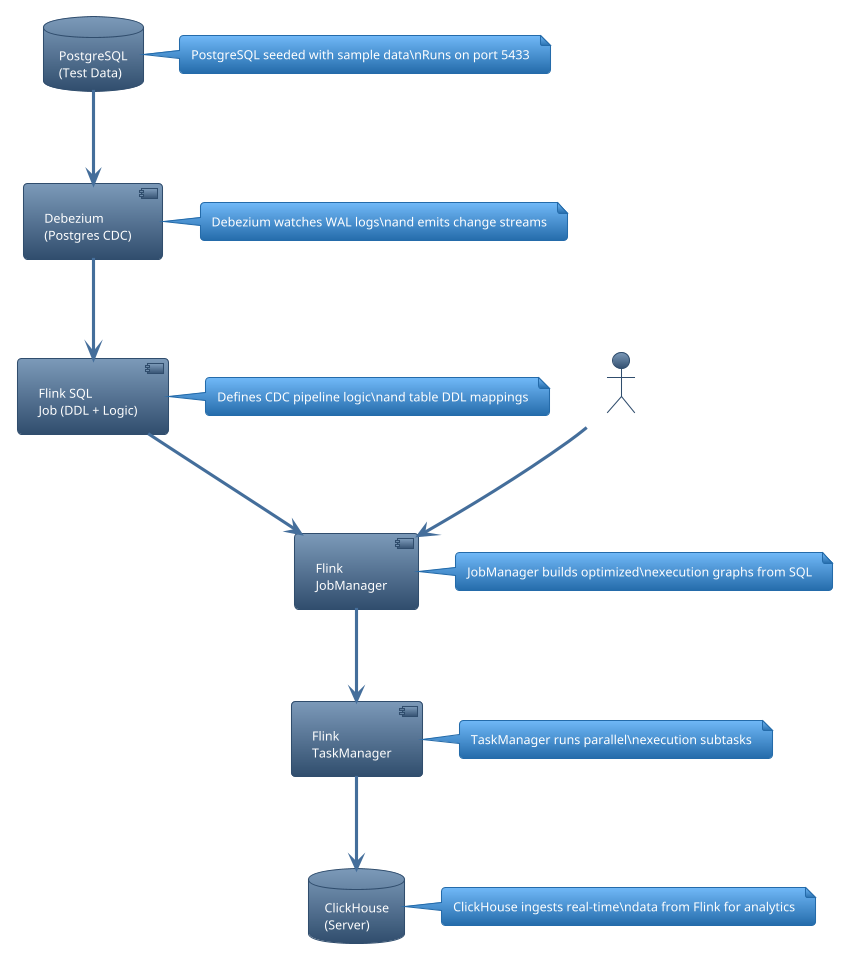

# 🚀 Flink PostgreSQL to ClickHouse CDC Pipeline

This project demonstrates a complete Flink CDC pipeline using:
- 📦 **Debezium** for PostgreSQL Change Data Capture
- 🔄 **Apache Flink** to process and transform changes in real-time
- 🛢️ **ClickHouse** as the analytical sink

## 🧱 Architecture Overview

To render the diagram below, use [Kroki.io](https://kroki.io) or a Markdown PlantUML renderer.


<details>
<summary>📜 PlantUML Source</summary>



</details>

## 🛠 Components

| Component     | Description                                   |
|---------------|-----------------------------------------------|
| PostgreSQL    | Source DB generating WAL logs for Debezium    |
| Debezium      | Captures WAL logs and produces CDC events     |
| Flink SQL     | Defines pipeline transformations (Flink DDL)  |
| JobManager    | Translates jobs into physical pipelines       |
| TaskManager   | Executes jobs and pushes to ClickHouse        |
| ClickHouse    | Real-time analytical store                    |

---

## ▶️ How to Run This Pipeline

1. **Start Flink & ClickHouse**:
```bash
./setup_pipeline.sh
```

2. **Open Flink SQL Client**:
```bash
./open_sql_client.sh
```

3. **Load the CDC job**:
```sql
Flink SQL> source sql/01_init.sql;
```

This will:
- Create a Flink CDC table from PostgreSQL
- Create a ClickHouse sink table
- Continuously mirror changes in real-time

---

## 🌐 Connect to External PostgreSQL

This project connects to a local or external PostgreSQL database (e.g. `postgres`) and uses Flink CDC to stream all changes into ClickHouse.

### 🔑 Connection Properties:
```toml
dbname = "postgres"
user = "postgres"
password = "postgres"
host = "localhost"
port = 5432
```

Ensure your PostgreSQL instance:
- Is reachable by Docker
- Has `wal_level = logical` enabled
- Has `max_replication_slots > 0`

---

## 🧪 Local Development

```bash
./setup_pipeline.sh
```

> This will:
> - Stop & clean existing containers
> - Download required JARs (Debezium + ClickHouse + Runtime)
> - Start PostgreSQL, Flink, and ClickHouse containers
> - Deploy SQL CDC pipeline
